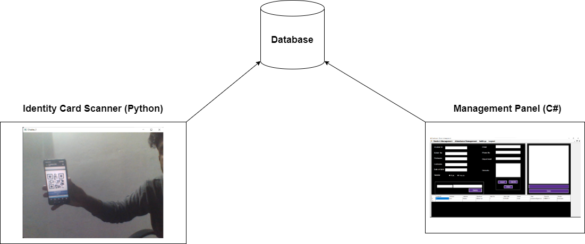
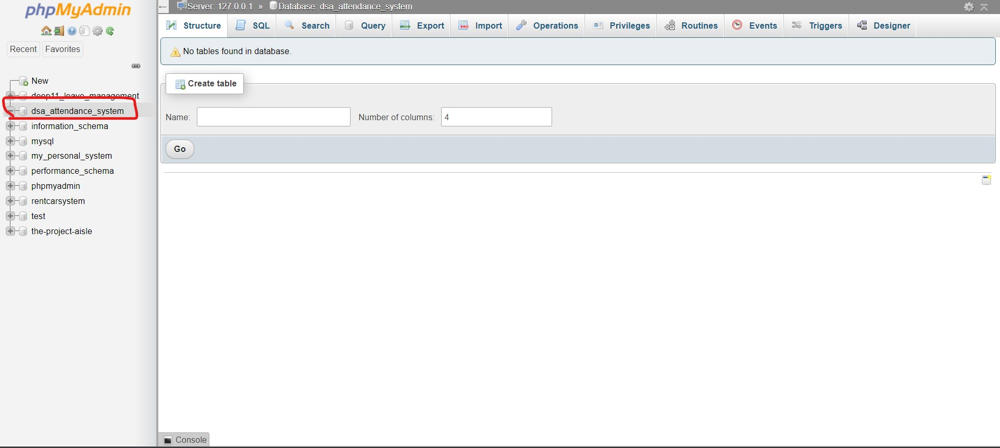
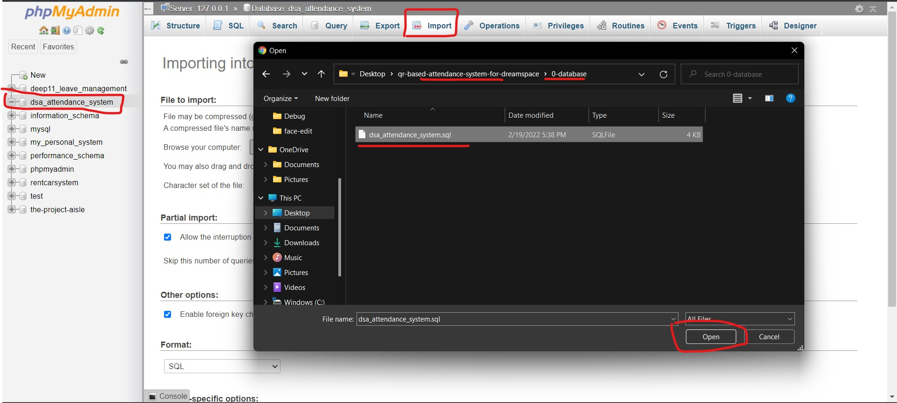
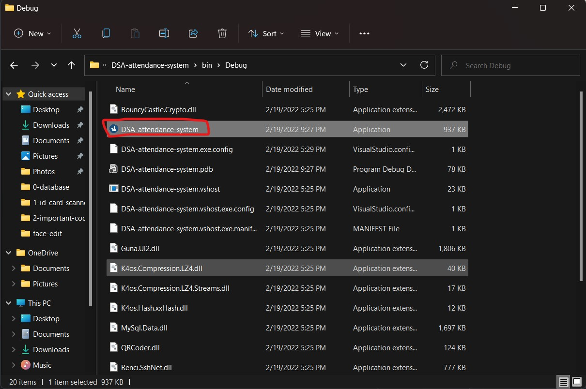
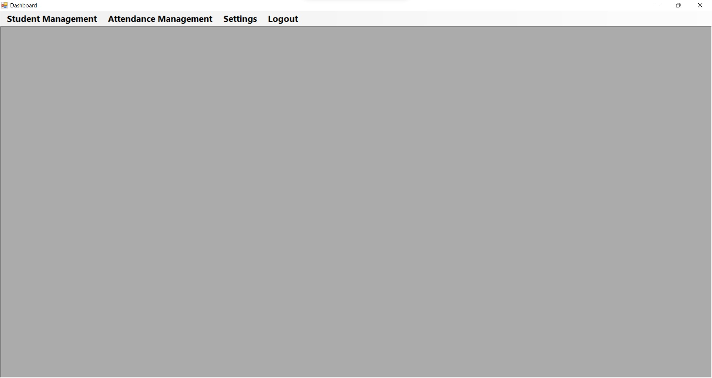
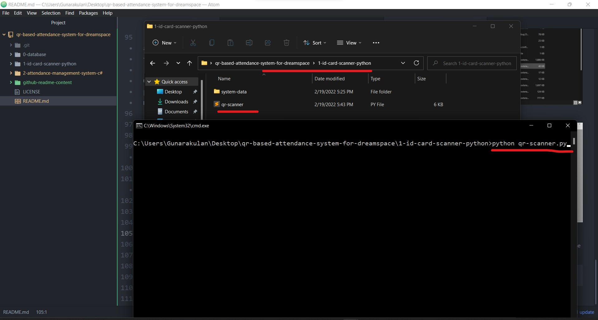
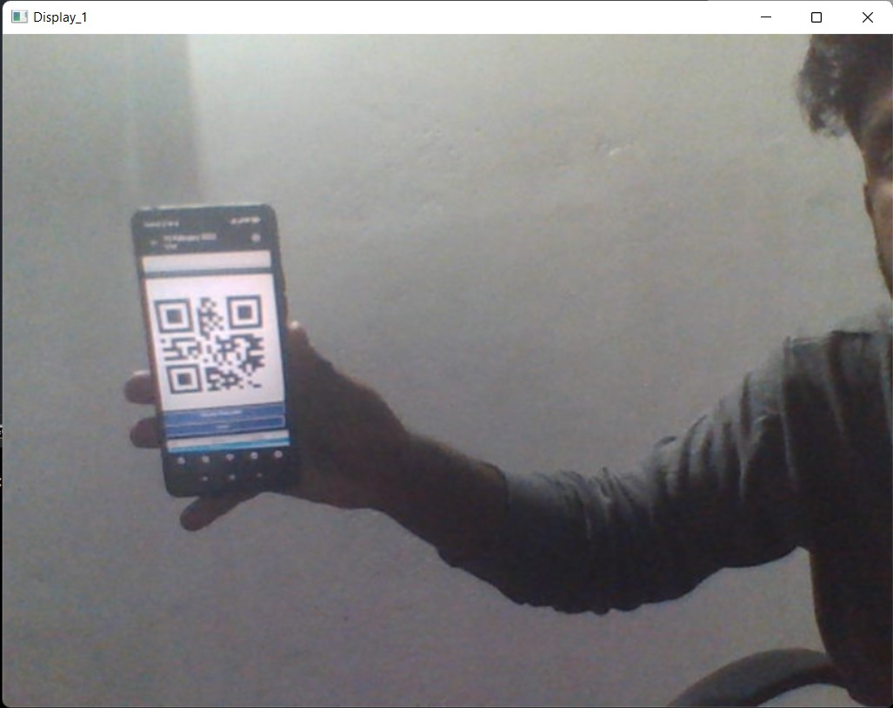
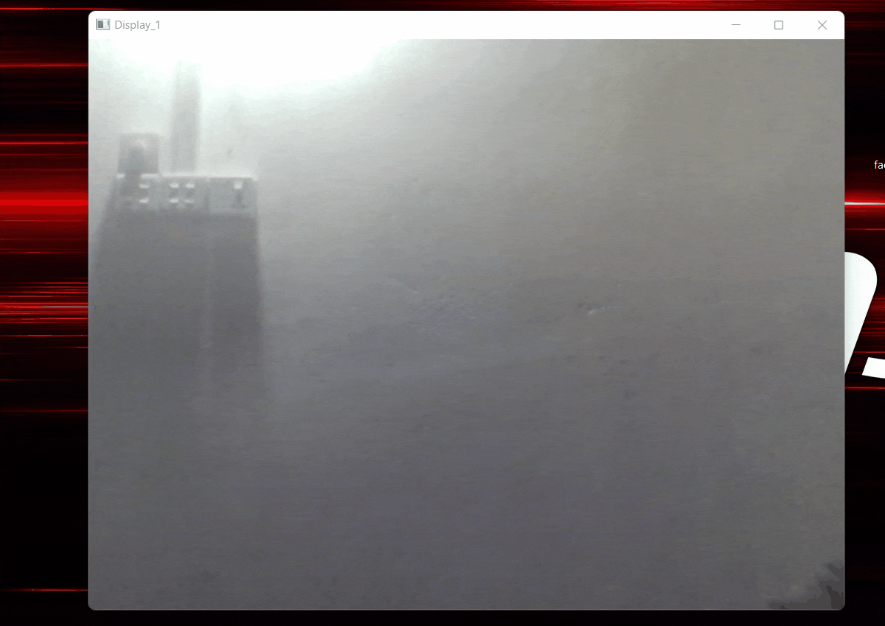
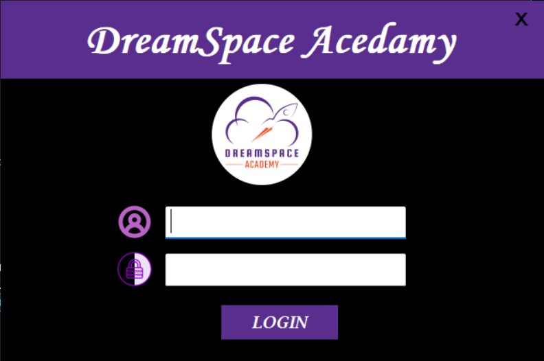
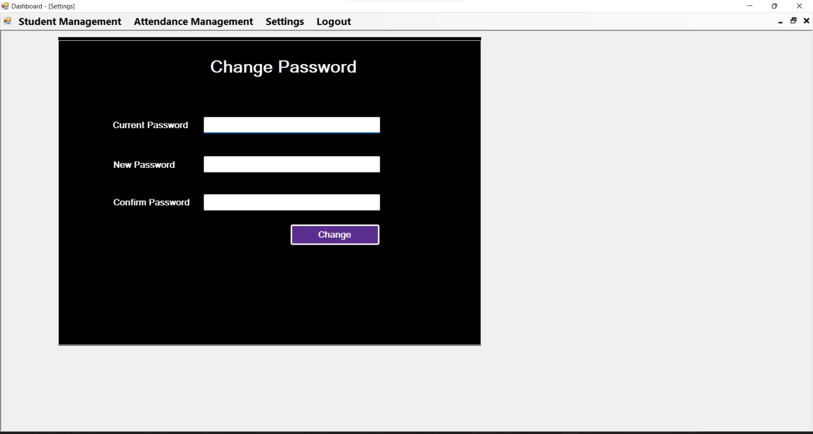

# QR Based Attendance System for DreamSpace


## Introduction

Attendance Management keeps track of your employee or students present/absent details. It is the system to document the time your employees/students work and the time they take off.

This is a computer vision based attendance system prototype that was developed for the DreamSpace Academy to manage the students attendances in a proper way.

This system is using the QR technology as an identity to index the employees/students. Every students or employees will have an identity card that was printed with a QR code. When they scan the QR code, it takes attendance of the particular student or employee.

This computerized system is using a camera as the QR code reader, because it is based on computer vision technology.

This system has two parts in it. The first one is the QR code scanner script that was written in Python, the second part is the management panel that is used to maintain and record attendance details (Written in C#).





## Features
- This system has two main parts: Identity Card Scanner | Management Panel.
- Identity cards could be scanned with the camera module.
- It has a management panel to maintain and record attendance details.
- It gives a welcome/greeting quotes when employees/students scans the QR code.
- Wrong QR code detection.
- This system has a female voice outputs.  
- Students/employees could be registered thorough the management panel.


## Technologies & Frameworks

#### Identity Card Scanner in Python
  - Python - Main programming language
  - Pyzbar - a module for QR code functions
  - PYTTSX3 - a module for voice outputs
  - Playsound - a module for playing external sounds


#### Management Panel in CSharp

  - C# - Main programming language
  - MySQL - Database.


## Configuration and Setup


### Setup Backend Management Panel (C#)

##### Step 01:
  - Create an empty database in MySQL panel with name of **"dsa_attendance_system"**.



##### Step 02:

  - Import into that empty database with a SQL database that is found on following folder of this repository **(qr-based-attendance-system-for-dreamspace/0-database)**.




### Setup Identity Card Scanner (Python)


##### Step 01:

  - Install the following dependencies in Python.

  01 Install OpenCV-Python
  ```
    pip install opencv-python
  ```

  02 Install Pyzbar
  ```
    pip install pyzbar
  ```

  03 Install PYTTSX3
  ```
    pip install pyttsx3
  ```

  04 Install playsound
  ```
    pip install playsound
  ```


## Execution and Running

After the importing of database and installation of dependencies, the project could be deployed.


##### Step 01: (Running Management Panel C#)

- The management panel project is found on the **"2-attendance-management-system-c#"** folder. This project folder can be opened with Visual Studio and then, we run (build) the project via clicking the start button. Otherwise, We can find the executable (EXE) of this project in the debug folder under the "2-attendance-management-system-c#" directory.


- Otherwise, the executable (EXE) will be found in the following path.
 ```
   2-attendance-management-system-c#\DSA-attendance-system\bin\Debug\DSA-attendance-system.exe
 ```



###### Management Panel



##### Step 02: (Running Identity Card Scanner Python)

- Navigate to the **"1-id-card-scanner-python"** folder and execute the following command.

 ```
  python qr-scanner.py
 ```



###### Identity Card Scanner




## Project Explained

### Identity Card Scanner Explained

Identity card scanner is the main part of this project. Here, the attendance taking part is done. Students/employees shows their identity card to this camera. It reads the QR code and updates the attendance to the database.




### Features

- Attendance will be added after scanning
- Repetitive identity card scanning is prevented on same day.
- Greeting message after scanning.
- 100% accuracy on detection
- Wrong QR detection


### Management Panel Explained

This is the management panel for this project. All the attendance data can be maintained and record here. The identity card scanner updates the attendance record to the database, this management panel is reading those data and manipulate here.


#### Login Page

This is the login page of this management panel. Here, the admin password needs to be entered in order to get into the system.

##### Credentials
- Username: **admin**
- password: **admin**


##### Features
  - Login functions
  - Proper message for wrong credentials




#### Splash Screen


#### Dashboard

This is the main dashboard of this management panel. It has 3 major following modules.

- Student Management
- Attendance Management
- Settings


#### Student Management

This module contains feature to manage students/employee data.

##### Features
 - Insert new students/employees
 - Delete existing students/employees data
 - Update existing students/employees data
 - QR code can be generated here.
 - QR code can be saved from this panel.
 - Searching option by student_id, firstname, email  


#### Attendance Management

This module contains feature to manage attendance data such as searching, filtering and etc.

##### Features
 - Show attendance reports based on date, department, batch.  


#### Setting Module

This is the module where the admin can change password of the system.

##### Features
 - Change admin password.



Any Questions? | Conduct Me
---

* [Linkedin Profile](https://www.linkedin.com/in/gunarakulan-gunaretnam-161119156/)
* [Facebook Profile](https://www.facebook.com/gunarakulan)
* [Twitter Profile](https://twitter.com/gunarakulang)
* [Instagram Profile](https://www.instagram.com/gunarakulan_gunaretnam/)
* [YouTube Channel](https://www.youtube.com/channel/UCMWkED5sabgVZSCKjZuRJXA/videos)
